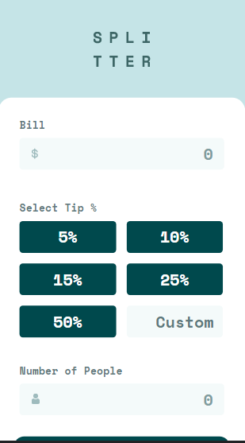
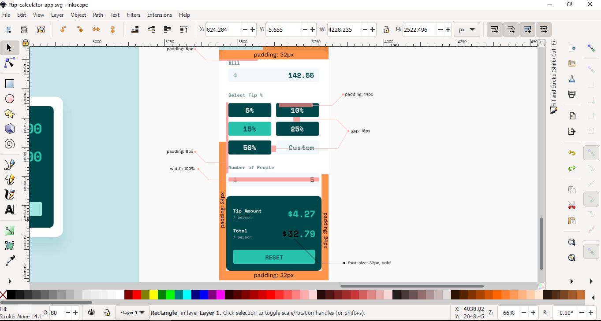

# Frontend Mentor - Tip calculator app solution

This is a solution to the [Tip calculator app challenge on Frontend Mentor](https://www.frontendmentor.io/challenges/tip-calculator-app-ugJNGbJUX). Frontend Mentor challenges help you improve your coding skills by building realistic projects.

## Table of contents

- [Overview](#overview)
  - [About the challenge](#about-the-challenge)
  - [Screenshots](#screenshots)
  - [Links](#links)
  - [How to run](#how-to-use)
- [My process](#my-process)
  - [Built with](#built-with)
  - [What I learned](#what-i-learned)
  - [Continued development](#continued-development)
  - [Useful resources](#useful-resources)
- [Author](#author)

## Overview

---

### About the challenge

Users should be able to:

- View the optimal layout for the app depending on their device's screen size
- See hover states for all interactive elements on the page
- Calculate the correct tip and total cost of the bill per person

### Screenshots


Screenshot of the app running on my **Local Development Server**.

What's in view:

- It's shows the design of the site on **Desktop** devices.

---




Screenshots of the app on **Mobile** devices.

What's in view:

- It's shows the design of the site on **Mobile**.

---



Screenshot of the **included** design file.

What's in view:

- It's shows the process I use to figure out things like the **positioning** and **spacing** of elements. You can learn more about that here: [Designing and Coding Layouts](https://github.com/AllanKirui/designing-and-coding-layouts)

---


Screenshot of the **App tree**.

What's in view:

- It's shows an overview of the components, how they communicate with each other and also describes the attached functionality.

### Links

- Solution URL: [Challenge Solution]()
- Live Site URL: [Tip Calculator](https://allankirui.github.io/tip-calculator-app/)

### How to use

- If you want to run my code, you need to follow these steps:

1. **Clone** the repository into a folder (Or if you chose to download a **zip** file, extract it's contents). **Run** `npm install` in the extracted project folder to install all **required dependencies** (This
   will create a **node_modules** folder)
2. **Run** `npm run serve` to bring up the **development server**. You can view the app at **localhost:8080**
   (or whichever **port** is shown in your **terminal**)

## My process

---

### Built with

- HTML5
- CSS Flexbox
- [Vue](https://v3.vuejs.org) - The Progressive JavaScript Framework
- [Inkscape](https://inkscape.org) - Inkscape: Open Source Scalable Vector Graphics Editor

### What I learned

The time I spent working on the project was a great way for me to practice my **Vue** skills - A great way for me to work with **Vue's** _reactivity_ and to get better at:

- **component communication**
  - This involves sending data from a _parent component_ to a _child component_ using a special **Vue** feature known as **[props](https://v3.vuejs.org/guide/component-props.html#prop-types)**.
  - The communication also works in the other direction i.e from a _child component_ to a _parent component_ using the built in **[custom events](https://v3.vuejs.org/guide/component-custom-events.html#event-names)** feature.

**Here's some of the code that I'm proud of**:

- The `v-model` _directive_ has a couple of useful _modifiers_ one of them being the `number` _modifier_. What the `number` _modifier_ does is that is converts the `String` input to a `Number`. It's the equivalent of getting the input and later on using `parseInt()` to do the conversion.

- I'm also validating the user's input upon a `blur` event and conditionally adding error styling to the input field and showing the error message if the value held by the `billValidity` data property meets the specified condition.

```html
<template>
  <!-- code here -->
  <input
    name="bill"
    type="text"
    placeholder="0"
    v-model.number="enteredBill"
    @blur="validateBillInput"
    :class="billValidity === 'invalid' ? 'error' : ''"
  />
  <!-- code here -->
  <p class="error" v-if="billValidity === 'invalid'">Can't be zero</p>
  <!-- code here -->
</template>
```

- Since there was no button in the design that you could click to perform the calculations, I found that using **[Vue's lifecycle methods](https://v3.vuejs.org/guide/composition-api-lifecycle-hooks.html)** i.e the `updated()` _lifecycle method_ to be quite handy.

- The `updated()` _lifecycle method_ runs every time there is a change to the _Vue Instance_ such as when a user start's typing on any of the input fields or when either one of the tip buttons is clicked.

- Inside the _lifecycle method_ I perform two checks:
  - The **first** thing I check for is if the `isReset` data property holds a _truthy_ value in which case I call the `resetCalculator()` method which effectively resets the calculator.
  - The **second** thing I check for is whether the user has provided a bill amount and a value for the number of people to split the bill with. If both of these data properties hold `truthy` values then the tip is calculated by the `calculateTip()` method and the results are sent to **TheOutput** component where they are displayed. _Having this check here allows the app to function in a manner whereby users can provide inputs in any order they wish._

```javascript
updated() {
    if (this.isReset) {
      this.resetCalculator();
    }
    if (this.enteredBill && this.enteredPeople) {
      this.calculateTip();
    }
  },
```

### Continued development

Going forward, I want to continue diving deeper into the **JavaScript** and **Vue** ecosystems. I also want to practice what I already know by tackling more projects built with **Vue**. Applying the features and best practices that I've learnt from working on this project.

### Useful resources

- [Inkscape](https://inkscape.org) - Inkscape SVG Editor. I use it all the time when I'm working on any web project. After designing the project, I used **Inkscape's** in-built tools to help me figure out the **spacing**, **sizing** and **positioning** of elements throughout the project. To better understand how I approached coding the project using Inkscape, have a look at this repository I made - [Designing and Coding Layouts](https://github.com/AllanKirui/designing-and-coding-layouts)

- [Vue Presentation](https://allankirui.github.io/A-Vuejs-Presentation/) - A while back after I had started learning **Vue**, I made a presentation on the framework. Do take a look, it might give you a better understanding of what the framework is about.

## Author

---

- Github - [Allan Kirui](https://www.github.com/AllanKirui)
- Instagram - [@nallawilljr](https://www.instagram.com/nallawilljr)

[Back to top](#frontend-mentor---tip-calculator-app-solution)
